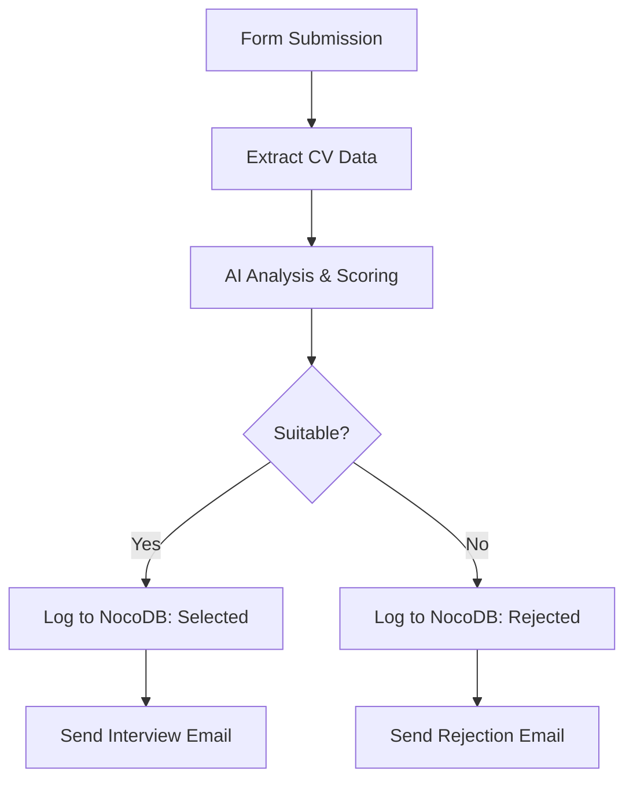
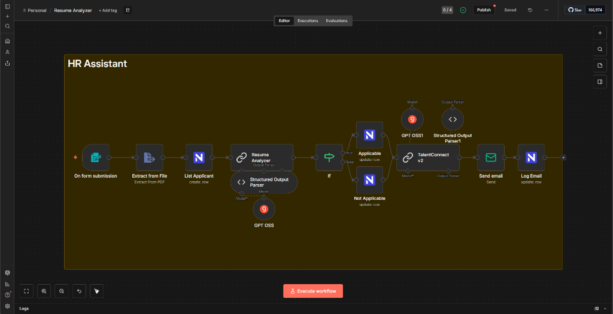

# HR Assistant (Resume Analyzer) 🤖

> *Automated recruitment assistant that analyzes resumes, scores candidates, and handles communication instantly.*

## 📌 Overview

**HR Assistant** is an intelligent automation workflow designed to streamline the recruitment process. It eliminates the manual bottleneck of initial resume screening.

**The Problem:** Reviewing hundreds of applications is time-consuming and prone to bias. HR teams often struggle to respond to every candidate timely.
**The Solution:** This agent autonomously analyzes incoming applications, scores them against job requirements, and ensures every applicant receives a personalized response—whether it's an interview invitation or a courteous rejection.

## ⚙️ How It Works

This agent follows a rigorous evaluation workflow triggered immediately upon form submission:

1.  **Ingestion**: Receives Applicant Name, Email, and CV (PDF/Docs) via a web form.
2.  **Extraction & Analysis**:
    *   Extracts text content from the uploaded CV.
    *   **AI Analysis**: Uses GPT-4o (or compatible OSS model) to analyze the CV against the specific Job Description and Requirements.
3.  **Scoring & Decision**:
    *   Assigns a suitability score (1-10).
    *   **Logic Gate**:
        *   **Score >= Threshold**: Candidate is marked as "Selected".
        *   **Score < Threshold**: Candidate is marked as "Not Suitable".
4.  **Action**:
    *   **Database**: Logs the applicant data, score, and status in NocoDB.
    *   **Communication**: Sends a personalized email via SMTP.
        *   *Selected*: Confirmation email with next steps.
        *   *Rejected*: Humble and professional rejection email.

### Workflow Diagram

## 🛠️ Tech Stack & Tools

*   **Orchestration:** n8n
*   **AI Models:** GPT OSS (Open Source / OpenAI compatible)
*   **Database:** NocoDB
*   **Communication:** SMTP Email
*   **File Handling:** PDF Extractor

## 📸 Visuals & Demo

> *Caption: The complete n8n workflow handling applicant ingestion, analysis, and automated communication.*

## 🚀 Key Features

*   ✅ **Auto-Scoring**: Objectively rates candidates 1-10 based on job fit.
*   ✅ **Instant Feedback**: 100% of applicants receive a response, improving employer brand.
*   ✅ **Structured Data**: Automatically organizes unstructured CV data into a database.
*   ✅ **Bias Reduction**: Standardized AI evaluation criteria for all applicants.

---

[⬅️ Back to Portfolio Root](../../README.md)
