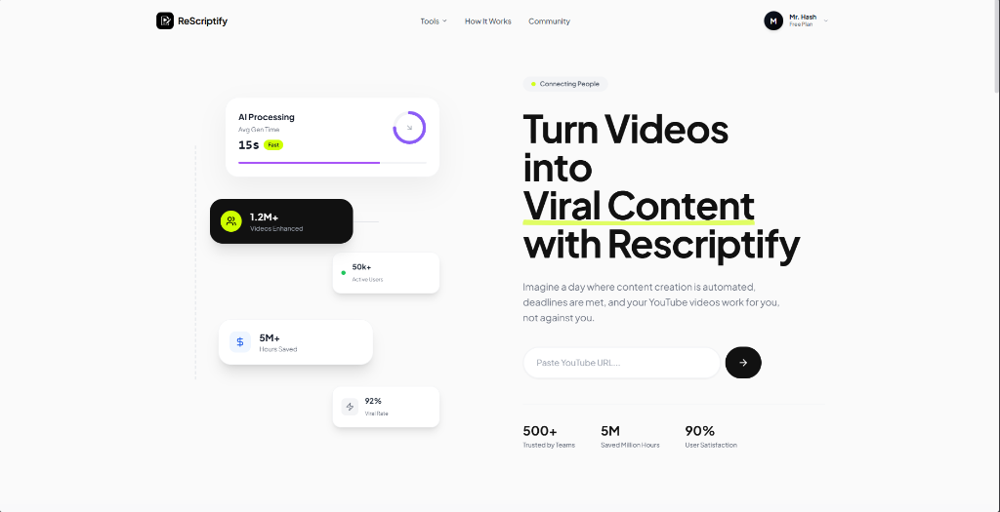

# Rescriptify (AI Content Repurposer) 🎬

> *Turn YouTube videos into viral content instantly. Generate blogs, scripts, and social posts from video transcripts.*

## 📌 Overview

**Rescriptify** is a powerful SaaS application designed to help content creators repurpose their existing video content. By simply pasting a YouTube link, the AI analyzes the video's transcript and transforms it into new, high-value assets.

**The Problem:** detailed video production is exhaustive, and repurposing that content into blogs, tweets, or short-form scripts takes significant manual effort.
**The Solution:** An automated pipeline that fetches video transcripts, understands the context, and generates perfectly formatted written content or new video scripts in seconds, tailored to specific tones, languages, and durations.

## ⚙️ How It Works

The workflow is powered by an **n8n** backend that orchestrates the entire process:

1.  **Input**: The user provides a YouTube video URL via the Rescriptify dashboard.
2.  **Transcription**: The system retrieves the video transcript.
3.  **AI Processing**:
    *   **Contextual Analysis**: The AI reads the transcript to understand key topics and speakers.
    *   **Generation**: Based on user selection (Language, Tone, Duration/Length), the AI generates the desired output (e.g., a "Professional" blog post or a "Funny" 3-minute script).
4.  **Delivery**: The generated content is presented to the user for editing or direct use.

### Features
*   **Multi-Format Generation**: Blogs, Video Scripts, Social Media Posts.
*   **Customizable Tones**: Informative, Professional, Engaging, Funny, etc.
*   **Variable Lengths**: Generate scripts for 1-2 mins, 3-5 mins, or deep dives (10+ mins).
*   **Multi-Language**: Repurpose content into different languages automatically.

## 🛠️ Tech Stack

*   **Orchestration & Backend**: n8n (The "Brain" of the operation)
*   **AI Models**: LLMs (GPT-4 / Claude) for context understanding and generation.
*   **Frontend**: React / Modern Web Framework (SaaS Dashboard)
*   **Integration**: YouTube Data API (Transcript fetching)

## 📸 Visuals

> *Caption: The Rescriptify interface showing the AI processing pipeline and content generation options.*

## 🚀 Impact

Rescriptify saves content creators **90% of their repurposing time**, allowing them to focus on filming and creativity while the AI handles the distribution formats.

---

[⬅️ Back to Portfolio Root](../../README.md)
