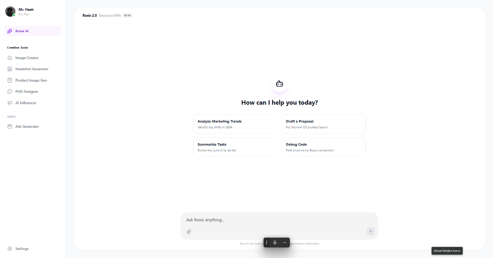
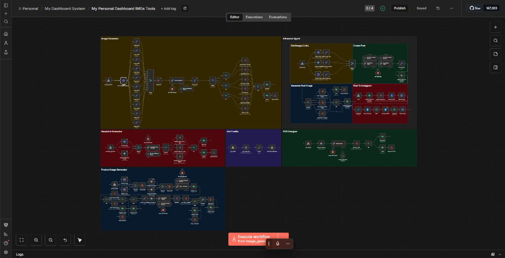

# Rosie AI (Generative AI Suite) 🎨

> *A comprehensive creative automation platform combining a sleek user dashboard with a complex multi-agent generative backend.*

## 📌 Overview

**Rosie AI** is an all-in-one generative AI workspace. It bridges the gap between complex backend automation and user-friendly interface design. Users can access a variety of specialized AI tools through a unified dashboard, while a sophisticated network of n8n workflows handles the heavy lifting of image generation, prompt engineering, and content creation.

**The Problem:** Accessing different AI modalities (headshots, product photography, social media copies) often requires hopping between multiple tools or dealing with complex API implementations.
**The Solution:** A centralized platform ("Rosie 2.0") where users can simply chat or click to generate professional assets, backed by a robust system of specialized AI agents.

## ⚙️ How It Works

This project consists of two main pillars:

### 1. The Frontend Dashboard
A modern, responsive web application that serves as the command center.
*   **Chat Interface:** Similar to ChatGPT, allowing conversational interaction with the AI.
*   **Tool Selection**: A sidebar menu providing access to specific generators (Image Creator, Headshot Generator, Product Image Gen, POD Designer, etc.).
*   **User Experience**: Designed for ease of use, hiding the complexity of the underlying models.

### 2. The Backend Workflow (n8n)
The "brain" of the operation is a massive n8n workflow that routes requests to the appropriate models.
*   **Routing Logic**: Determines whether a user needs a text response, a generated image, or a specific task like "Ads Generation".
*   **Specialized "Imaginators"**:
    *   **Product Image Generator**: Creating marketing assets for e-commerce.
    *   **Headshot Generator**: Professional profile pictures from casual photos.
    *   **Common Image Generator**: General-purpose text-to-image creation.
    *   **AI Influencer**: Managing virtual persona content.
    *   **Video Ads Generator**: Creating video scripts and content for advertisements.

## 📸 Visuals

### The Dashboard

> *The user-facing frontend allowing easy access to powerful generative tools.*

### The "Brain" (Workflow)

> *The intricate web of nodes in n8n handling logic, API calls, and image generation routing.*

## 🛠️ Tech Stack

*   **Frontend**: React / Next.js (Dashboard Interface)
*   **Orchestration**: n8n (Complex multi-agent workflow)
*   **AI Models**: Stable Diffusion, Midjourney (via API), GPT-4 (for chat and prompts)
*   **Integration**: Webhooks for real-time frontend-backend communication

---

[⬅️ Back to Portfolio Root](../../README.md)
