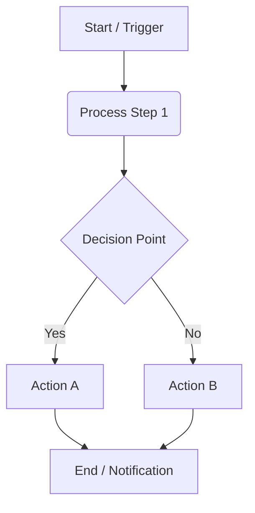

# [Agent Name] 🤖

> *Short tagline or one-sentence summary of what this agent accomplishes.*

## 📌 Overview

**[Agent Name]** is an automation workflow designed to [briefly describe the main function]. It addresses the problem of [problem description] by [solution strategy].

## ⚙️ How It Works

This agent follows a specifically designed workflow:

1.  **Trigger**: [Event that starts the automated process]
2.  **Process**:
    *   Step A: [Description]
    *   Step B: [Description]
3.  **Output**: [Final result/action]

### Workflow Diagram

## 🛠️ Tech Stack & Tools

*   **Platform:** [e.g., n8n, Make.com]
*   **AI Models:** [e.g., GPT-4o]
*   **Integrations:**
    *   [Icon] Service A
    *   [Icon] Service B

## 📸 Visuals & Demo

> *Caption: A snapshot of the automation workflow in action.*

## 🚀 Key Features

*   ✅ **Feature 1**: Description
*   ✅ **Feature 2**: Description
*   ✅ **Feature 3**: Description

---

[⬅️ Back to Portfolio Root](../../README.md)
